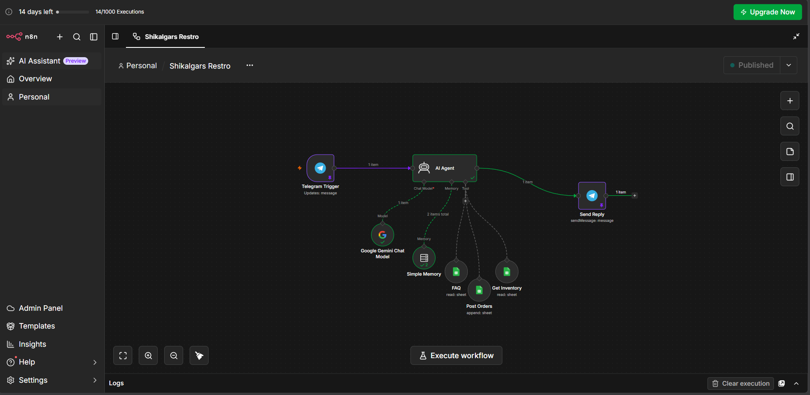

# 🍽️ Shikalgar's Restaurant Bot

An AI-powered food ordering bot for **Shikalgar's Restaurant**, built with [n8n](https://n8n.io), Telegram, Google Gemini, and Google Sheets. Customers chat with the bot on Telegram, browse the menu, check live inventory, and place orders — all handled by an autonomous AI agent with persistent memory.

🔗 **Try the bot:** [@shikalgars_restro_bot](https://t.me/shikalgars_restro_bot)



---

## ✨ Features

- 💬 Natural language ordering via Telegram — no rigid commands needed
- 🤖 Powered by **Google Gemini** as the reasoning engine (via n8n's AI Agent node)
- 🧠 **Per-user conversation memory** — each Telegram chat gets its own session, so context isn't shared between customers
- 📋 **Live menu & FAQ lookup** from Google Sheets
- 📦 **Real-time inventory checks** before confirming an order
- ✅ **Order logging** — confirmed orders are appended directly to a Google Sheet
- ⚡ Fully automated, serverless-style workflow — no backend code to host or maintain

---

## 🛠️ Tech Stack

| Component | Tool |
|---|---|
| Workflow engine | [n8n](https://n8n.io) (cloud or self-hosted) |
| Chat interface | Telegram Bot API |
| AI reasoning | Google Gemini (Chat Model) |
| Memory | n8n Simple Memory (session-based, keyed by Telegram chat ID) |
| Data storage | Google Sheets (Menu, FAQ, Inventory, Orders) |

---

## 🧩 How It Works

1. **Telegram Trigger** — listens for incoming messages to the bot
2. **AI Agent** — receives the message text, reasons over it using Gemini, and decides what to do (answer FAQ, check inventory, place an order)
3. **Tools** the agent can call:
   - `FAQ` — reads from a Google Sheet of common questions
   - `Get Inventory` — reads current stock levels from a Google Sheet
   - `Post Orders` — appends a confirmed order to a Google Sheet
4. **Simple Memory** — keeps track of the conversation per user (keyed by `chat.id`), so the bot remembers context like previous menu items discussed
5. **Telegram (Send Message)** — sends the AI Agent's response back to the customer on Telegram

---

## 🚀 Setup & Installation

### Prerequisites
- An [n8n](https://n8n.io) account (cloud or self-hosted instance)
- A Telegram account
- A Google account (for Sheets + Gemini API access)

### 1. Create your Telegram bot
1. Open Telegram and message **[@BotFather](https://t.me/BotFather)**
2. Send `/newbot` and follow the prompts (choose a name and a username ending in `bot`)
3. BotFather will give you a **bot token** — save it, you'll need it in n8n

### 2. Set up Google Sheets
Create a Google Sheet with the following tabs:
- `Menu` — item name, price, description
- `FAQ` — question, answer
- `Inventory` — item name, stock quantity
- `Orders` — timestamp, customer name, order details, status

Share the sheet with the Google account you'll connect to n8n.

### 3. Import the workflow into n8n
1. In n8n, go to **Workflows → Import from File** (or copy-paste the JSON if you're sharing one)
2. Open the **Telegram Trigger** node → under Credentials, click **Connect to Telegram** → paste your bot token from step 1
3. Open the **Google Gemini Chat Model** node → connect your Google/Gemini API credential
4. Open each **Google Sheets** node (`FAQ`, `Get Inventory`, `Post Orders`) → connect your Google Sheets credential and select the correct spreadsheet/tab for each

### 4. Configure the AI Agent
- Open the **AI Agent** node
- Set **Source for Prompt (User Message)** to **Expression**
- Set the prompt field to:
  ```
  {{ $json.message.text }}
  ```
- Review/edit the **System Message** to match your restaurant's name, menu rules, and tone

### 5. Configure Memory
- Open the **Simple Memory** node
- Set the **Session ID / Session Key** field to:
  ```
  {{ $json.message.chat.id }}
  ```
  This ensures each Telegram user has an isolated conversation thread.

### 6. Add the reply node
- After the **AI Agent** node, add a **Telegram** node (action, not trigger) set to **Send Message**
- **Chat ID:**
  ```
  {{ $('Telegram Trigger').item.json.message.chat.id }}
  ```
- **Text:**
  ```
  {{ $json.output }}
  ```

### 7. Activate & test
1. Toggle the workflow to **Active** (top right of the n8n editor)
2. Open Telegram and message your bot: [@shikalgars_restro_bot](https://t.me/shikalgars_restro_bot)
3. Check the **Executions** tab in n8n to confirm the workflow ran end-to-end
4. Confirm you received a reply in Telegram

---

## 📸 Screenshots

*(Add screenshots of the bot conversation here once available)*

---

## ⚠️ Known Limitations

- Telegram API only allows **one active Telegram Trigger per bot** at a time
- Free-text parsing is handled by the LLM, not by fixed inline keyboards (currently no button-based menu navigation)
- No payment integration yet — orders are logged for manual confirmation

---

## 🗺️ Roadmap

- [ ] Inline keyboard menu navigation
- [ ] Order status tracking for customers
- [ ] Admin notifications for new orders
- [ ] Payment gateway integration

---

## 📄 License

This project is open for personal and educational use. Feel free to fork and adapt for your own restaurant or business.

---

## 🙋 Author

**Arman Shikalgar**
Built as a hands-on project exploring AI agents, workflow automation, and conversational commerce with n8n.
